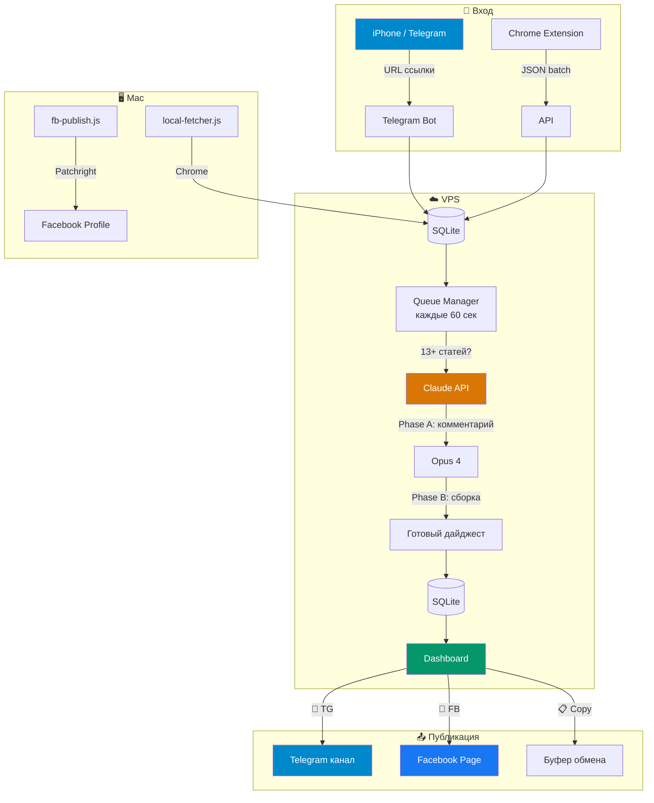
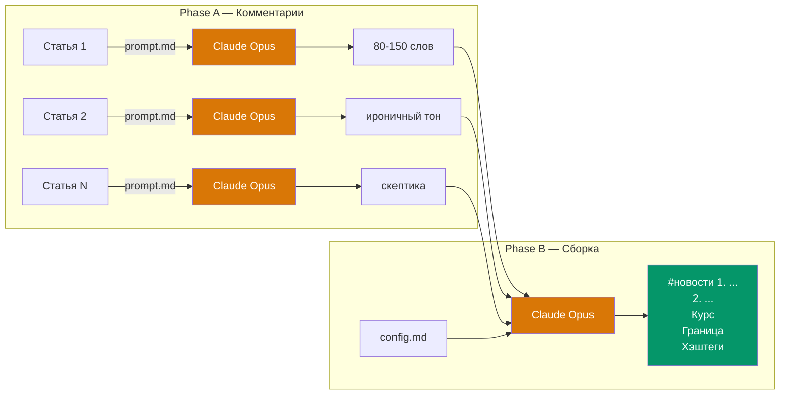
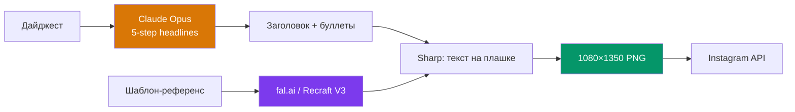
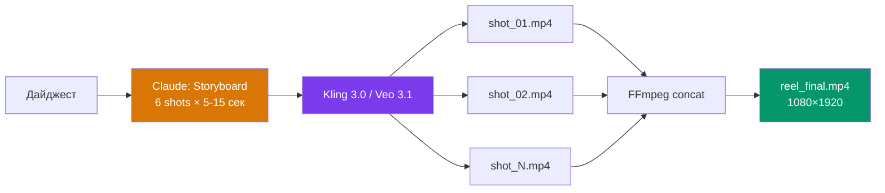

**Оговорка!** Это не коммерческий проект, т.е. я не поддерживаю его в особо актуальном состоянии, я его просто использую сам. Иногда чего-то допиливаю, и даже не забываю комитить сюда. Поэтому просто скачивайте, поручайте ИИ разобраться и переделывайте под себя, как хотите. ИИ вам ответить на любой вопрос.

# News Digest Pipeline v2.0.4

[](CHANGELOG.md)
[](https://nodejs.org/)
[](https://www.anthropic.com/)
[](https://www.docker.com/)
[](https://www.sqlite.org/)
[](LICENSE)
[](#)
[](#)

> Автоматизированный пайплайн: собирает новости → генерирует авторские комментарии через Claude API → публикует в Telegram, Facebook, Instagram.
>
> Проект реализован в рамках учебного курса: **Создание ИИ Агентов и приложений для бизнеса, роста, дохода и кайфа.** Хотите научиться делать такое же, а не смотреть как баран на новые ворота? Попробуйте этот курс. 14 дней пробный период: **https://alexeykrol.com/ai_full/**

---

<p align="center">
  
</p>

---

## Как это работает

1. У вас установлено приложение **[Perplexity](https://perplexity.ai)** на телефоне — в нём есть удобный дайджест новостей (Discover)
2. Вы открываете Perplexity, переходите в Discover и прокручиваете новости
3. Понравилась новость — нажимаете **«Поделиться»** → **Telegram** → выбираете вашего бота
4. Когда накопилось **13+ статей** — Claude API автоматически генерирует дайджест, и на дашборде появляется готовый текст с кнопками публикации
5. Заходите в **Dashboard**, находите нужный дайджест и нажимаете куда хотите опубликовать: **📨 TG** (Telegram), **📘 FB** (Facebook) или оба

Без ручного копирования, без вёрстки, без рутины.

**Примеры готовых дайджестов:**
[Facebook](https://www.facebook.com/alex.v.krol/posts/pfbid02oj14ZFeSvyrrpcNN8dBJoJ6YsegA4gSeqtsSdhVMjkAYZU15aFuRH7msPN3EuE8al) ・ [Telegram](https://t.me/alexkrol/8510) ・ [YouTube](http://youtube.com/post/UgkxFs7bfPTzCMBtYq_UT2ttLd6TVNRenVRL?si=olNJLuQs_ZVqlarq)

---

## Что нужно до запуска

| Шаг | Что сделать | Инструкция |
|-----|------------|-----------|
| 1 | Настроить **VPS-сервер** (Ubuntu, Docker, Traefik) | [vps-setup.md](news-digest-pipeline/docs/vps-setup.md) |
| 2 | Создать **Telegram-бота** через @BotFather и настроить webhook | [telegram-setup.md](news-digest-pipeline/docs/telegram-setup.md) |
| 3 | Получить **Claude API ключ** на [console.anthropic.com](https://console.anthropic.com/) | — |
| 4 | *(опционально)* Создать **Facebook App** и получить Page Access Token | [facebook-page-setup.md](news-digest-pipeline/docs/facebook-page-setup.md) |
| 5 | *(опционально)* Настроить **Facebook Profile** автопубликацию (Patchright) | [facebook-setup.md](news-digest-pipeline/docs/facebook-setup.md) |
| 6 | Заполнить `.env` файл и запустить `docker compose up -d` | [Быстрый старт](#быстрый-старт) |

---

## Архитектура



---

## Быстрый старт

### 1. Форк и клонирование

```bash
git clone https://github.com/YOUR_USERNAME/news.git
cd news/news-digest-pipeline
```

### 2. Настройка

```bash
cp .env.example .env
```

Заполните `.env`:

```env
# Обязательные
ANTHROPIC_API_KEY=sk-ant-...        # Claude API ключ
TELEGRAM_BOT_TOKEN=123456:ABC...    # Токен от @BotFather
TELEGRAM_CHAT_ID=123456789         # Ваш Telegram user ID

# Опционально (для публикации)
TELEGRAM_PUBLISH_CHAT_ID=-100...   # ID канала для публикации
FACEBOOK_PAGE_ID=...               # ID Facebook Page
FACEBOOK_PAGE_ACCESS_TOKEN=...     # Page Access Token

# Безопасность
API_SECRET_KEY=...                 # Сгенерируйте: openssl rand -base64 32
DASHBOARD_PASSWORD=...             # Отдельный пароль для дашборда
```

### 3. Запуск

```bash
npm install
npm start
```

Дашборд: `http://localhost:3000` (логин: `admin` / ваш `DASHBOARD_PASSWORD`)

### 4. Production (Docker)

```bash
docker compose up -d --build
```

---

## Как работает генерация



Два промпта управляют стилем:
- **[prompt.md](prompt.md)** — как писать комментарий (тон, длина, формат)
- **[assembly_prompt.md](assembly_prompt.md)** — как собирать дайджест (порядок, курс, подвал)
- **[config.md](config.md)** — хэштеги, упоминание курса, граница

---

## Dashboard

| Функция | Описание |
|---------|----------|
| 👁 **Смотреть** | Превью первых 3 новостей |
| 📨 **TG** | Публикация в Telegram канал |
| 📘 **FB** | Публикация на Facebook Page |
| 📋 **Копировать** | Текст в буфер обмена |
| ✕ **Удалить** | Удалить дайджест |
| **Статус** | Черновик / Опубликован (с датой) |

Защищён HTTP Basic Auth + rate limiting.

---

## Facebook Profile (Browser Automation)

> **⚠️ ВНИМАНИЕ: ВЫСОКИЙ РИСК БАНА АККАУНТА**
>
> Автоматическая публикация в **личный профиль** Facebook через browser automation (Patchright, Playwright, Puppeteer, Selenium) **может привести к silent ban вашего аккаунта**. Facebook детектирует автоматизацию и без предупреждения начинает удалять все ваши посты — даже те, которые вы публикуете вручную. При этом Account Quality остаётся чистым, никакого уведомления о нарушении нет.
>
> **Что мы обнаружили на собственном опыте:**
> - Тестовые посты через Patchright (особенно с текстом вроде «test», «automation») вызвали срабатывание спам-фильтра
> - Фильтр распространился на ВСЕ публикации с аккаунта — включая ручные
> - Ограничение затронуло даже второй аккаунт с того же IP
> - Восстановление заняло 3-7 дней полного молчания
>
> **Рекомендации:**
> - Публикация на **Facebook Page через API** — безопасна (Graph API, другой механизм модерации)
> - Публикация в **Telegram** — безопасна (Bot API)
> - Публикация в **личный профиль** — только вручную (копировать текст с дашборда)
> - **Никогда** не публикуйте тестовые посты с вашего основного аккаунта
> - **Никогда** не делайте rapid publish/delete циклы — это главный триггер
>
> Полное исследование проблемы: [facebook-shadow-ban-research.md](news-digest-pipeline/docs/facebook-shadow-ban-research.md)

Код для browser automation сохранён в проекте как **экспериментальный** — используйте на свой страх и риск, только с тестовыми аккаунтами:

```bash
# Первый раз — залогиниться
node scripts/fb-publish.js --login

# Публикация (⚠️ РИСК БАНА — только тестовые аккаунты!)
node scripts/fb-publish.js latest
```

Подробнее: [docs/facebook-setup.md](news-digest-pipeline/docs/facebook-setup.md) — детальное описание борьбы с Facebook bot detection.

---

## Медиа-пайплайны (в разработке)

### Instagram (изображения)



### Video (Reels / Shorts)



---

## API

Все endpoints (кроме `/health`) требуют аутентификации: `Authorization: Bearer <API_SECRET_KEY>`

| Метод | Endpoint | Описание |
|-------|----------|----------|
| `GET` | `/health` | Статус сервера (публичный) |
| `GET` | `/` | Dashboard (Basic Auth) |
| `POST` | `/api/articles` | Добавить статью по URL |
| `POST` | `/api/articles/batch` | Пакетная загрузка |
| `GET` | `/api/articles/stats` | Статистика |
| `POST` | `/api/digests/generate` | Ручная генерация |
| `GET` | `/api/digests` | Список дайджестов |
| `GET` | `/api/digests/:id/text` | Чистый текст |
| `POST` | `/api/digests/:id/publish` | Публикация `{platforms: ["telegram","facebook"]}` |
| `DELETE` | `/api/digests/:id` | Удалить дайджест |

---

## Безопасность

- API и Dashboard защищены аутентификацией (Bearer / Basic Auth)
- Раздельные ключи для API и Dashboard
- Rate limiting: 30 req/min (API), 10 attempts/15min (Dashboard)
- SSRF-защита: whitelist только `perplexity.ai`
- Timing-safe сравнение ключей
- `.env` не в git, права `0600`

Полный аудит: [SECURITY_AUDIT_2026-04-13.md](SECURITY_AUDIT_2026-04-13.md)

---

## Структура

```
├── prompt.md                     # Промпт: комментарий к статье
├── assembly_prompt.md            # Промпт: сборка дайджеста
├── config.md                     # Хэштеги, курс, граница
│
├── news-digest-pipeline/
│   ├── src/
│   │   ├── index.js              # Express + auth + rate limiting
│   │   ├── middleware/auth.js    # Bearer + Basic Auth
│   │   ├── db/                   # SQLite (better-sqlite3)
│   │   ├── routes/               # API endpoints
│   │   ├── services/             # Claude API, publishers, queue
│   │   └── public/index.html    # Dashboard
│   ├── scripts/
│   │   ├── fb-publish.js         # Facebook Profile (Patchright)
│   │   ├── local-fetcher.js      # Chrome content extraction
│   │   └── monitor.sh           # VPS monitoring
│   ├── production/
│   │   └── image/                # Instagram image pipeline
│   ├── distribution/             # Platform-specific publishers
│   ├── docs/                     # Setup guides
│   ├── Dockerfile
│   └── docker-compose.yml
│
└── extension/                    # Chrome extension
```

---

## Документация

| Тема | Файл |
|------|------|
| Telegram (бот + канал) | [telegram-setup.md](news-digest-pipeline/docs/telegram-setup.md) |
| Facebook Page (Graph API) | [facebook-page-setup.md](news-digest-pipeline/docs/facebook-page-setup.md) |
| Facebook Profile (Patchright) | [facebook-setup.md](news-digest-pipeline/docs/facebook-setup.md) |
| VPS + Docker + Traefik | [vps-setup.md](news-digest-pipeline/docs/vps-setup.md) |
| iOS Shortcut | [ios-shortcut-setup.md](news-digest-pipeline/docs/ios-shortcut-setup.md) |
| Instagram Pipeline | [instagram/README.md](news-digest-pipeline/instagram/README.md) |
| Video Pipeline | [distribution/video/README.md](news-digest-pipeline/distribution/video/README.md) |

---

## Стек

| Компонент | Технология |
|-----------|-----------|
| Backend | Node.js 20, Express, SQLite |
| AI | Claude API (Opus 4), Anthropic SDK |
| Images | fal.ai, Recraft V3, Sharp |
| Video | Kling 3.0, Veo 3.1, FFmpeg |
| Browser | Patchright (stealth Playwright) |
| Deploy | Docker, Traefik, Ubuntu 24.04 |
| Notifications | Ntfy.sh |

---

## Лицензия

MIT
