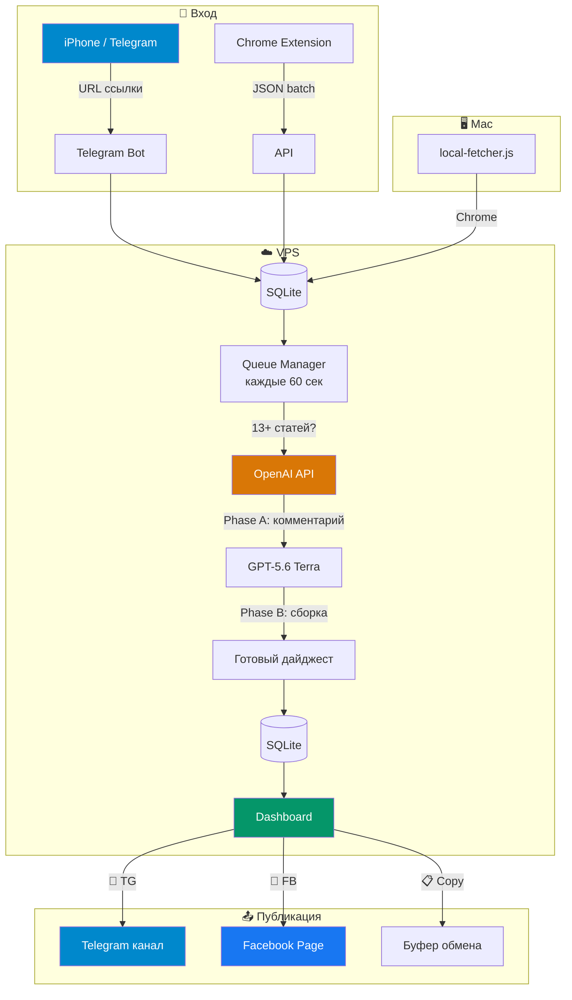

**Оговорка!** Это не коммерческий проект, т.е. я не поддерживаю его в особо актуальном состоянии, я его просто использую сам. Иногда чего-то допиливаю, и даже не забываю комитить сюда. Поэтому просто скачивайте, поручайте ИИ разобраться и переделывайте под себя, как хотите. ИИ вам ответит на любой вопрос.

# News Digest Pipeline v2.0.4

[](CHANGELOG.md)
[](https://nodejs.org/)
[](https://openai.com/)
[](https://www.docker.com/)
[](https://www.sqlite.org/)
[](LICENSE)
[](#)
[](#)

> Автоматизированный пайплайн: собирает новости → генерирует авторские комментарии через OpenAI (GPT-5.6 Terra) → публикует в **Telegram** и **Facebook Page**.
>
> Проект реализован в рамках учебного курса: **Создание ИИ Агентов и приложений для бизнеса, роста, дохода и кайфа.** Хотите научиться делать такое же, а не смотреть как баран на новые ворота? Попробуйте этот курс. 14 дней пробный период: **https://alexeykrol.com/ai_full/**

---

## 🆓 Это бесплатная версия

Перед вами **бесплатная (open-source, MIT) версия** проекта. Это полностью рабочий, самодостаточный пайплайн: собрать новости → сгенерировать авторские дайджесты → опубликовать в Telegram и на Facebook Page. Ничего не урезано в основном цикле — берите, разворачивайте, пользуйтесь.

**Да, есть и платная (Pro) версия.** Она добавляет каналы распространения (Instagram, видео-Reels), работу с чужими FB-постами как источником и AI-модерацию комментариев. Полное сравнение — в таблице ниже. Pro пока не публичный продукт: если интересно — пишите автору или приходите на курс.

### Бесплатная vs платная

| Возможность | 🆓 Бесплатная (эта версия) | 💎 Pro |
|---|:---:|:---:|
| Сбор новостей (Perplexity → Telegram / Chrome-расширение) | ✅ | ✅ |
| Генерация авторских комментариев (GPT-5.6 Terra, 2 фазы) | ✅ | ✅ |
| Дашборд с настройками + сценарии стиля (Сарказм / Архитектор) | ✅ | ✅ |
| Публикация в **Telegram**-канал | ✅ | ✅ |
| Публикация на **Facebook Page** (Graph API) | ✅ | ✅ |
| Копирование текста в буфер (ручной постинг куда угодно) | ✅ | ✅ |
| Безопасность (fail-closed auth, rate limiting, security-заголовки) | ✅ | ✅ |
| Чужие **FB-посты как источник** дайджеста (browserless-чтение) | — | ✅ |
| Автопостинг **картинок в Instagram** (fal.ai / Recraft V3) | — | ✅ |
| **AI-модерация комментариев** FB Page (судья, shadow/live, авто-бан) | — | ✅ |
| **Видео** Reels / Shorts, **аудио**-озвучка (TTS) | — | 🚧 |
| Новые каналы: TikTok / YouTube / Email / единый автопостер | — | 🚧 |

> **Легенда:** ✅ есть ・ 🚧 в разработке ・ — нет. Обе версии всегда получают одинаковый уровень **безопасности** — фиксы прилетают в бесплатную версию наравне с Pro.

---

<p align="center">
  
</p>

---

## Как это работает

1. У вас установлено приложение **[Perplexity](https://perplexity.ai)** на телефоне — в нём есть удобный дайджест новостей (Discover)
2. Вы открываете Perplexity, переходите в Discover и прокручиваете новости
3. Понравилась новость — нажимаете **«Поделиться»** → **Telegram** → выбираете вашего бота
4. Когда накопилось **13+ статей** — модель (OpenAI, GPT-5.6 Terra) автоматически генерирует дайджест, и на дашборде появляется готовый текст с кнопками публикации
5. Заходите в **Dashboard**, находите нужный дайджест и нажимаете куда хотите опубликовать: **📨 TG** (Telegram), **📘 FB** (Facebook Page) или оба

Без ручного копирования, без вёрстки, без рутины.

**Примеры готовых дайджестов:**
[Facebook](https://www.facebook.com/alex.v.krol/posts/pfbid02oj14ZFeSvyrrpcNN8dBJoJ6YsegA4gSeqtsSdhVMjkAYZU15aFuRH7msPN3EuE8al) ・ [Telegram](https://t.me/alexkrol/8510) ・ [YouTube](http://youtube.com/post/UgkxFs7bfPTzCMBtYq_UT2ttLd6TVNRenVRL?si=olNJLuQs_ZVqlarq)

---

## Что нужно до запуска

| Шаг | Что сделать | Инструкция |
|-----|------------|-----------|
| 1 | Настроить **VPS-сервер** (Ubuntu, Docker, Traefik) | [vps-setup.md](news-digest-pipeline/docs/vps-setup.md) |
| 2 | Создать **Telegram-бота** через @BotFather и настроить webhook | [telegram-setup.md](news-digest-pipeline/docs/telegram-setup.md) |
| 3 | Получить **OpenAI API ключ** на [platform.openai.com](https://platform.openai.com/) | — |
| 4 | *(опционально)* Создать **Facebook App** и получить Page Access Token | [facebook-page-setup.md](news-digest-pipeline/docs/facebook-page-setup.md) |
| 5 | Заполнить `.env` файл и запустить `docker compose up -d` | [Быстрый старт](#быстрый-старт) |

---

## Архитектура



---

## Быстрый старт

### 1. Форк и клонирование

```bash
git clone https://github.com/YOUR_USERNAME/news.git
cd news/news-digest-pipeline
```

### 2. Настройка

```bash
cp .env.example .env
```

Заполните `.env`:

```env
# Обязательные
NODE_ENV=production                 # На сервере обязательно (иначе авторизация отключится)
LLM_VENDOR=openai                   # Провайдер: anthropic | openai
CLAUDE_MODEL=gpt-5.6-terra          # ID модели (историческое имя переменной, vendor-agnostic)
OPENAI_API_KEY=sk-...               # OpenAI API ключ
TELEGRAM_BOT_TOKEN=123456:ABC...    # Токен от @BotFather
TELEGRAM_CHAT_ID=123456789          # Ваш Telegram user ID
TELEGRAM_WEBHOOK_SECRET=...          # Обязателен для приёма новостей из Telegram

# Опционально (для публикации)
TELEGRAM_PUBLISH_CHAT_ID=-100...   # ID канала для публикации
FACEBOOK_PAGE_ID=...               # ID Facebook Page
FACEBOOK_PAGE_ACCESS_TOKEN=...     # Page Access Token

# Безопасность
API_SECRET_KEY=...                 # Сгенерируйте: openssl rand -base64 32
DASHBOARD_PASSWORD=...             # Отдельный пароль для дашборда
```

### 3. Запуск

Для локальной разработки — `npm run dev` (авторизация отключена, `NODE_ENV=development`):

```bash
npm install
npm run dev
```

Дашборд: `http://localhost:3000` (локально всё открыто — редактирование без логина).

В production запускайте с `NODE_ENV=production` — авторизация включена, гости видят дашборд только на чтение, редактирование после логина (`admin` / ваш `DASHBOARD_PASSWORD`):

```bash
NODE_ENV=production npm start
```

### 4. Production (Docker)

```bash
docker compose up -d --build
```

---

## Как работает генерация


Два промпта управляют стилем:
- **[prompt.md](prompt.md)** — как писать комментарий (тон, длина, формат)
- **[assembly_prompt.md](assembly_prompt.md)** — как собирать дайджест (порядок, курс, подвал)
- **[config.md](config.md)** — хэштеги, упоминание курса, граница

---

## Dashboard

| Функция | Описание |
|---------|----------|
| 👁 **Смотреть** | Превью первых 3 новостей |
| 📨 **TG** | Публикация в Telegram канал |
| 📘 **FB** | Публикация на Facebook Page |
| 📋 **Копировать** | Текст в буфер обмена |
| ✕ **Удалить** | Удалить дайджест |
| **Статус** | Черновик / Опубликован (с датой) |

Дашборд публичен на чтение (гости видят только безопасные поля, без внутренних метрик и идентификаторов); редактирование, генерация и публикация доступны после логина. Записи защищены server-side: проверка кред на каждую мутацию + rate limiting.

---

## Facebook: только Page, не личный профиль

> **⚠️ Почему автопубликация в личный профиль УДАЛЕНА из проекта**
>
> Автоматическая публикация в **личный профиль** Facebook через browser automation (Patchright, Playwright, Puppeteer, Selenium) **приводит к silent ban аккаунта**. Facebook детектирует автоматизацию и без предупреждения начинает удалять все ваши посты — даже те, которые вы публикуете вручную. При этом Account Quality остаётся чистым, никакого уведомления о нарушении нет.
>
> **Что мы обнаружили на собственном опыте:**
> - Тестовые посты через browser automation (особенно с текстом вроде «test», «automation») вызвали срабатывание спам-фильтра
> - Фильтр распространился на ВСЕ публикации с аккаунта — включая ручные
> - Ограничение затронуло даже второй аккаунт с того же IP
> - Восстановление заняло 3-7 дней полного молчания
>
> **Именно поэтому автопубликация в личный профиль удалена из проекта.** Поддерживается только **Facebook Page через Graph API** — другой, безопасный механизм.

**Как публиковать безопасно:**
- **Facebook Page через API** — поддерживается в проекте (Graph API, безопасно)
- **Telegram** — поддерживается (Bot API, безопасно)
- **Личный профиль** — только вручную: скопируйте текст с дашборда (📋) и опубликуйте сами

Полное исследование проблемы: [facebook-shadow-ban-research.md](news-digest-pipeline/docs/facebook-shadow-ban-research.md)

---

## 💎 Что добавляет платная (Pro) версия

Бесплатной версии достаточно, чтобы вести один канал (Telegram + FB Page) в полностью автоматическом режиме. Pro-версия расширяет проект в сторону **мультиканального распространения и работы с чужим контентом**:

- **FB-посты как источник.** Кроме новостей из Perplexity — добавляйте в дайджест чужие публичные посты Facebook по прямой ссылке (browserless-чтение, без логина и риска для аккаунта).
- **Instagram (картинки).** Дайджест → заголовки → генерация фонового изображения (fal.ai / Recraft V3) → плашка с текстом (Sharp) → пост 1080×1350 в Instagram.
- **AI-модерация комментариев** под постами Facebook Page. Дешёвая модель-судья классифицирует каждый комментарий (бан / подозрительный / чистый). Режимы **Shadow** (обкатка на реальной ленте без действий) и **Live** (авто-бан/скрытие), настраиваемый порог авто-бана, отдельная модель-улучшатель промптов, журнал решений и история коррекций.
- **Видео и аудио** *(в разработке)*. Reels / Shorts (сториборд → Kling / Veo → FFmpeg, 1080×1920) и озвучка дайджестов (TTS).
- **Новые каналы** *(в разработке)* — TikTok, YouTube, Email-рассылка, единый автопостер.

Pro пока не оформлен как публичный продукт с ценником. Если нужна такая версия — пишите автору или приходите на [курс](https://alexeykrol.com/ai_full/).

---

## API

**Модель доступа:**

- **Чтение (`GET`) — публичное.** Анонимным вызовам публичные `GET` отдают только безопасные поля (внутренние — стоимость, токены, id внешних постов, логи генерации, telegram-идентификаторы — скрыты). Аутентифицированный владелец (сессия дашборда **или** `Authorization: Bearer <API_SECRET_KEY>`) видит полные данные.
- **Записи (`POST` / `PATCH` / `DELETE`)** требуют `Authorization: Bearer <API_SECRET_KEY>` или сессию дашборда.

| Метод | Endpoint | Описание |
|-------|----------|----------|
| `GET` | `/health` | Статус сервера (публичный) |
| `GET` | `/` | Dashboard — публичный, только чтение для гостей, редактирование после логина |
| `POST` | `/api/articles` | Добавить статью по URL |
| `POST` | `/api/articles/batch` | Пакетная загрузка |
| `GET` | `/api/articles` | Список статей (публичный, безопасные поля) |
| `GET` | `/api/articles/stats` | Статистика |
| `POST` | `/api/digests/generate` | Ручная генерация |
| `GET` | `/api/digests` | Список дайджестов (публичный, безопасные поля) |
| `GET` | `/api/digests/:id/text` | Чистый текст |
| `POST` | `/api/digests/:id/publish` | Публикация `{platforms: ["telegram","facebook"]}` |
| `DELETE` | `/api/digests/:id` | Удалить дайджест |

---

## Безопасность

- **Модель доступа:** публичное чтение (только безопасные поля) + аутентифицированные записи (Bearer-токен или сессия дашборда).
- **Fail-closed авторизация:** на сервере обязателен `NODE_ENV=production`. Авторизация отключается ТОЛЬКО при явном `NODE_ENV=development` или `test` (для локальной разработки без трения). Любое другое значение, опечатка или пустое — авторизация ВКЛючена (защита от «тихого» открытия API при мисконфиге).
- **Только Bearer-токен для API** — query-параметр `?key=` убран (он утекал в логи Traefik/morgan).
- **Rate limiting:** 30 req/min (API), 10 неудачных попыток записи / 15 мин на IP (до проверки кред — защита от перебора), 20 попыток логина / 15 мин, 60 req/min (Telegram webhook).
- **Security-заголовки на всех ответах:** `X-Content-Type-Options: nosniff`, `X-Frame-Options: DENY`, `Referrer-Policy: no-referrer`, `Cross-Origin-Opener-Policy: same-origin`, `Strict-Transport-Security` (в production). Заголовок `X-Powered-By` отключён.
- **Единая валидация URL статей** (HTTPS + whitelist `perplexity.ai` + запрет управляющих символов, хранится нормализованный href) на всех входах (API, batch, Telegram) и в `local-fetcher.js` — закрывает инъекцию в AppleScript.
- **SSRF-защита:** whitelist только `perplexity.ai`.
- **Telegram webhook fail-closed:** требует `TELEGRAM_WEBHOOK_SECRET`; без секрета webhook отвергает все запросы (403).
- **Timing-safe** сравнение ключей.
- **Сессия дашборда:** HMAC-подписанная HttpOnly session cookie.
- `.env` не в git, права `0600`.

Полный аудит: [SECURITY_AUDIT_2026-04-13.md](SECURITY_AUDIT_2026-04-13.md)

---

## Структура

```
├── prompt.md                     # Промпт: комментарий к статье
├── assembly_prompt.md            # Промпт: сборка дайджеста
├── config.md                     # Хэштеги, курс, граница
│
├── news-digest-pipeline/
│   ├── src/
│   │   ├── index.js              # Express + auth + rate limiting
│   │   ├── middleware/auth.js    # Bearer + Basic Auth
│   │   ├── db/                   # SQLite (better-sqlite3)
│   │   ├── routes/               # API endpoints (+ public-dto.js — безопасные поля)
│   │   ├── services/             # LLM API (OpenAI/Anthropic), publishers, queue (+ url-validator.js)
│   │   └── public/index.html    # Dashboard
│   ├── scripts/
│   │   ├── local-fetcher.js      # Chrome content extraction
│   │   ├── monitor.sh            # VPS monitoring
│   │   └── setup-cron.sh         # Cron setup
│   ├── docs/                     # Setup guides
│   ├── Dockerfile
│   └── docker-compose.yml
│
└── extension/                    # Chrome extension
```

---

## Документация

| Тема | Файл |
|------|------|
| Telegram (бот + канал) | [telegram-setup.md](news-digest-pipeline/docs/telegram-setup.md) |
| Facebook Page (Graph API) | [facebook-page-setup.md](news-digest-pipeline/docs/facebook-page-setup.md) |
| VPS + Docker + Traefik | [vps-setup.md](news-digest-pipeline/docs/vps-setup.md) |
| iOS Shortcut | [ios-shortcut-setup.md](news-digest-pipeline/docs/ios-shortcut-setup.md) |

---

## Стек

| Компонент | Технология |
|-----------|-----------|
| Backend | Node.js 20, Express, SQLite |
| AI | OpenAI (GPT-5.6 Terra), OpenAI SDK |
| Извлечение контента | Реальный Chrome через AppleScript (local-fetcher) |
| Deploy | Docker, Traefik, Ubuntu 24.04 |
| Notifications | Ntfy.sh |

---

## Лицензия

MIT
